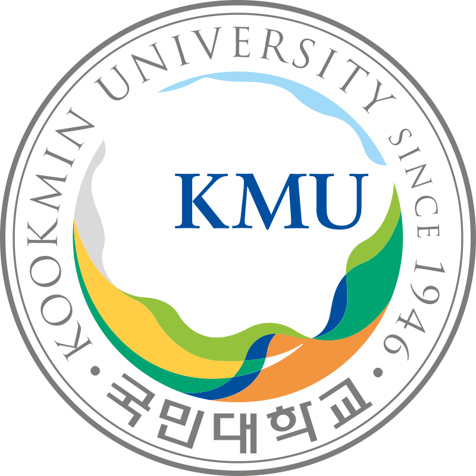

## 너 누군데?

<figure style="text-align:center;">
  
  <figcaption>
    <a href="https://www.kookmin.ac.kr">국민대학교</a>
  </figcaption>
</figure>

국민대학교 소프트웨어학부를 졸업했고, 국민대학교 대학원 컴퓨터공학과 졸업 예정인 학생입니다. \
학창 시절에는 수학/물리를 되게 좋아했습니다(물리는 지금 다 까먹은 듯... 시간 있다면 역학 쪽 다시 공부하고 싶네요).

대학원은 정보보호 연구실 나왔습니다. \
메인 연구는 MinHash, Locality Sensitive Hashing 에 기반한 고속 검색 알고리즘을 연구했고, AI-based 침입 탐지 시스템 등을 연구했습니다. \
보안 자체를 연구하기 보다는 보안 도메인에서 발생하는 여러 문제들을 해결하는데 시간을 들였습니다.

예전부터 기록의 중요성을 느끼고 있어서 블로그를 통해 글을 남기고자 합니다.

## 뭐 남길건데?
요새는 수학 공부를 많이 하고 있습니다. 유튜브 [수학의 즐거움](https://www.youtube.com/@enjoyingmath9346)에서 열리는 스터디에도 참가하여 공부도 하고 있습니다. 거기서 공부하다가 정리해야 할 것들을 정리할 것입니다.

수학 공부는 크게 두 가지 분야에서 하려고 합니다.
- 스터디에서 진행하는 레벨의 확률론(엄밀한 선)
- 금융 수학(확률론과 젤 연관 있을 듯 ㅎㅎ)
  

물론 저의 주 전공은 컴퓨터공학이기 때문에 CS 분야도 포스팅 하고자 합니다. \
크게 2가지 파트 같네요.
- 개발 관련한 잡담
- 읽는 논문 관련한 내용
  

제대로 정리하여 이걸 읽는 누군가도 많이 얻어가고, 저도 많이 얻길 바랍니다.

